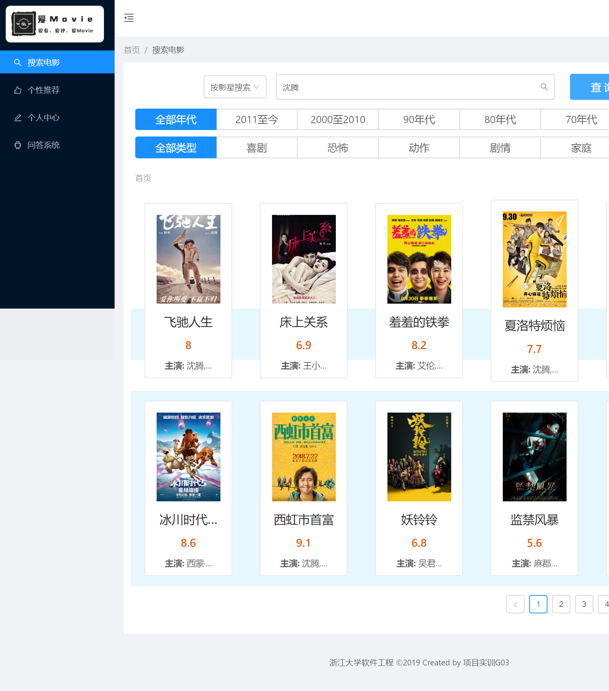
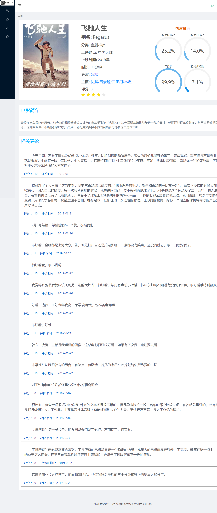
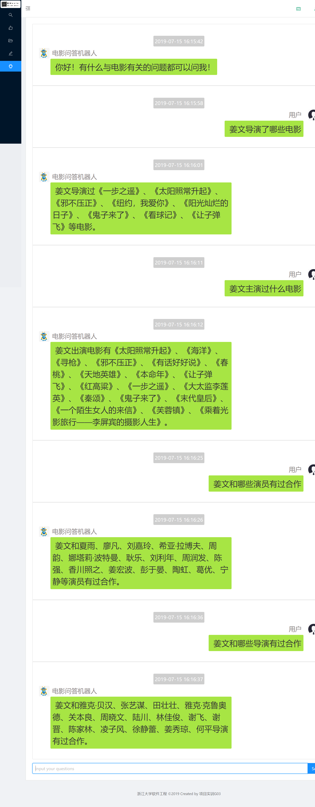
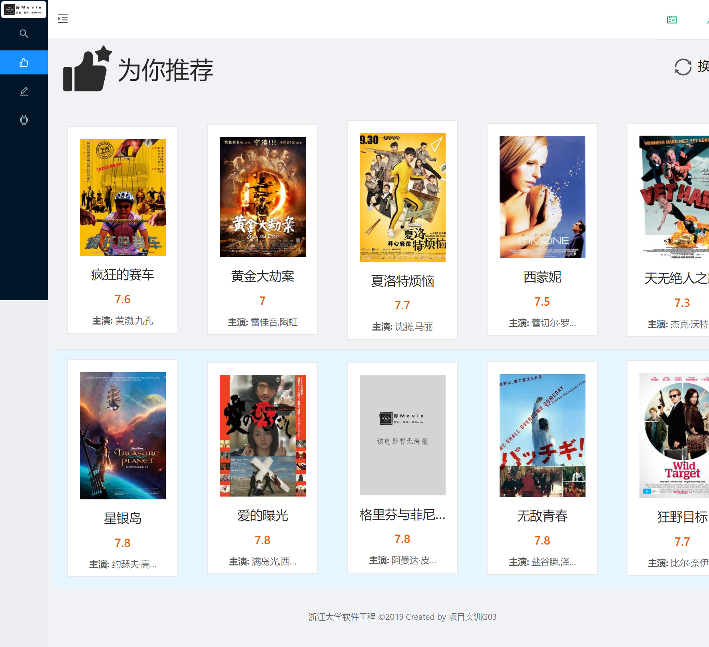

# 电影垂直搜索引擎

电影数据共26000余条。

数据库
- neo4j-community-3.5.7

搜索引擎
- elasticsearch-rtf

Python依赖
- pip install -r requirement.txt

## **知识图谱**

构建的知识图谱共77000余个实体，162000余个关系。

实体种类：
- Celebrity
- Movie
- Category

关系种类：
- is
- act_in
- direct

## 系统模块：
- 搜索
- 电影详情
- 个人中心，词云
- 问答系统
- 推荐系统

## 系统截图

- 搜索

- 电影详情

- 词云

- 问答

- 推荐
